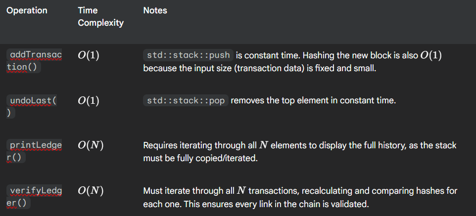

Cryptographic Transaction Ledger (Mini-Blockchain)

A C++ implementation of a secure, linked ledger system. This project simulates the core mechanics of a blockchain by using cryptographic hashing to ensure the immutability and integrity of a transaction history.

🎯 Project Goal and Core Concepts

The Problem

Traditional databases can be easily altered, making them unsuitable for maintaining a trustless record of transactions. This ledger solves the problem by chaining every transaction to the one before it using a hash, making any unauthorized modification immediately detectable.

The Goal

To build a secure, linked data structure that enforces:

Immutability: Any change to an old transaction will break the chain link of all subsequent transactions.

Verifiability: The integrity of the entire chain can be checked instantly using the verifyLedger() function.

Auditability: The system maintains a complete, ordered history of all transactions.

💻 Core Implementation Details

1. Cryptographic Linkage and Hashing

Linking: Each Transaction (block) stores the hash of the immediately preceding transaction in its prevHash field.

Proof-of-Integrity: The currHash of a transaction is generated by hashing the transaction data (sender, receiver, amount) combined with the prevHash.

Hashing Implementation: For simplicity and portability, std::hash is used on a serialized string of the transaction data to simulate the cryptographic proof. In a production environment, this would be replaced with a robust algorithm like SHA-256.

2. Data Structure: Stack (std::stack)

The Ledger class uses a std::stack<Transaction> to manage the chain.

Rationale: The stack naturally supports the two primary actions required:

Adding: Transactions are added to the chain's end using push().

Undoing: The ability to revert the very last transaction is easily achieved with pop().

⏱️ Time Complexity Analysis

The efficiency of the Ledger class is dominated by the performance of the std::stack operations, where $N$ is the number of transactions currently in the ledger.

Must iterate through all $N$ transactions, recalculating and comparing hashes for each one. This ensures every link in the chain is validated.

The ledger is optimized for adding and removing the latest records, reflecting the typical, sequential nature of ledger systems.

🚀 How to Build and Run

Prerequisites

A C++ compiler (g++ recommended).

C++11 standard or newer.

Compilation

Navigate to the project root directory in your terminal and compile the two source files together:

g++ -std=c++17 main.cpp Ledger.cpp -o ledger

Execution

Run the compiled executable to interact with the Command Line Interface:

./ledger

Use the menu options (1-4) to add transactions, view the complete history, and test the Verify Ledger Integrity function.